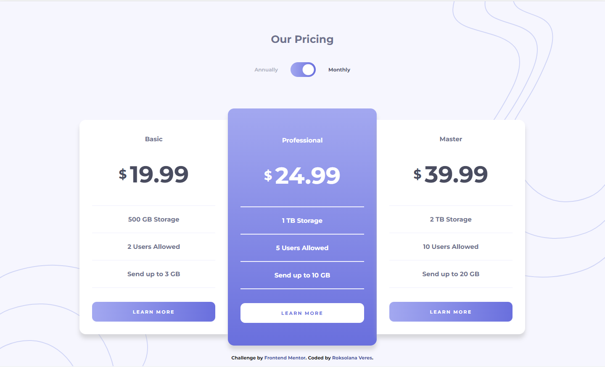
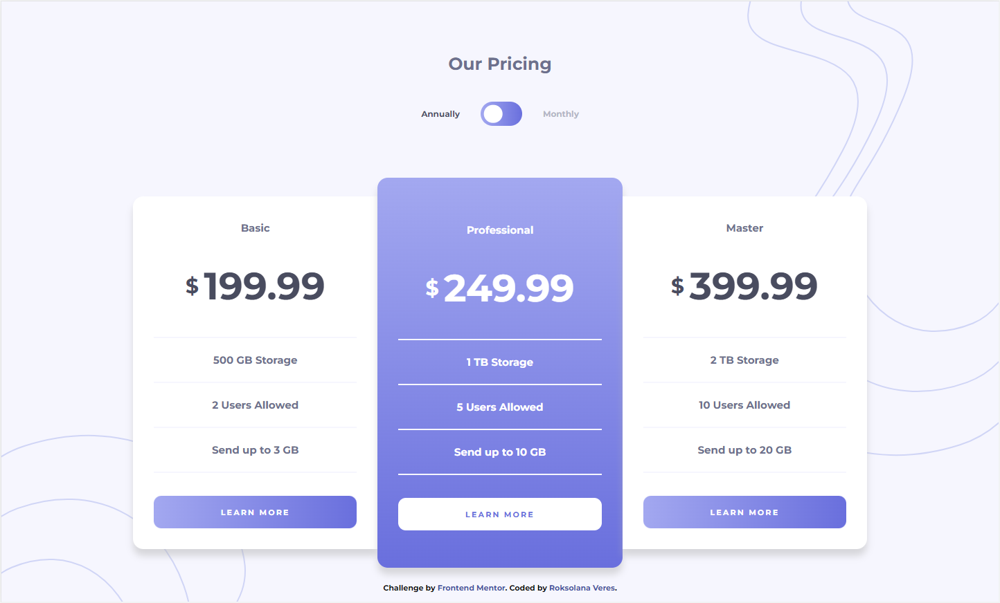
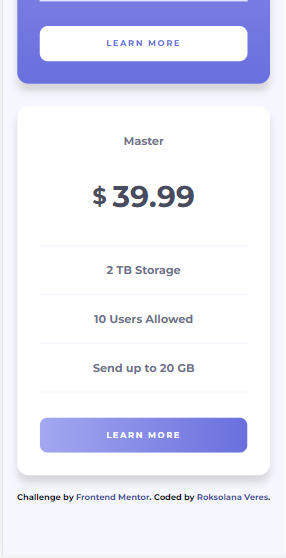
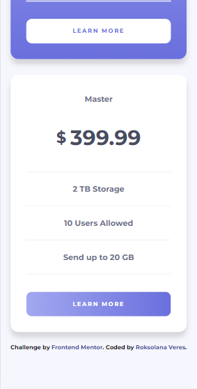

# Frontend Mentor - Pricing component with toggle solution

This is a solution to the [Pricing component with toggle challenge on Frontend Mentor](https://www.frontendmentor.io/challenges/pricing-component-with-toggle-8vPwRMIC). Frontend Mentor challenges help you improve your coding skills by building realistic projects.

## Table of contents

- [Overview](#overview)
  - [The challenge](#the-challenge)
  - [Screenshots](#screenshots)
  - [Links](#links)
- [My process](#my-process)
  - [Built with](#built-with)
  - [What I learned](#what-i-learned)
  - [Useful resources](#useful-resources)
- [Author](#author)

## Overview

### The challenge

Users should be able to:

- View the optimal layout for the component depending on their device's screen size
- Control the toggle with both their mouse/trackpad and their keyboard
- **Bonus**: Complete the challenge with just HTML and CSS

### Screenshots

### Links

- [Frontend Mentor solution](https://www.frontendmentor.io/solutions/responsive-tip-calculator-app-Dgneqi3k7t)
- [GitHub repo](https://github.com/RoksolanaVeres/Pricing-component-with-toggle_without-JS)
- [Live Site](https://roksolanaveres.github.io/Pricing-component-with-toggle_without-JS/)

## My process

### Built with

- Semantic HTML5 markup
- CSS custom properties
- Flexbox
- CSS Grid
- Mobile-first workflow
- BEM naming convention

### What I learned

- learned how to make a toggle button
- practiced the usage of :has() pseudo-class

### Useful resources

- [:has()](https://developer.mozilla.org/en-US/docs/Web/CSS/:has)
- [Toggle button](https://www.youtube.com/watch?v=0QJP5-Hyndw&ab_channel=Treehouse)
- [More on toggle button](https://web.dev/building-a-switch-component/)

## Author

- Frontend Mentor - [@RoksolanaVeres](https://www.frontendmentor.io/profile/RoksolanaVeres)
